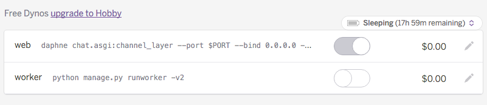
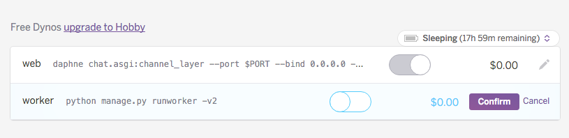
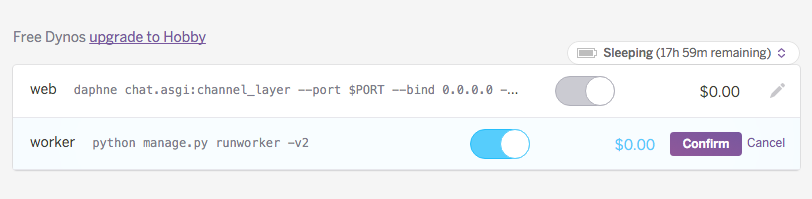
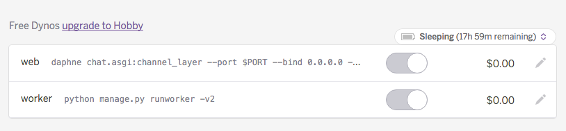

# Try out Django Channels today! 

This is an example app demonstrating how to use (and deploy) [Django Channels](http://channels.readthedocs.org/en/latest/). It's a simple real-time chat app — like a very, very light-weight Slack. There are a bunch of rooms, and everyone in the same room can chat, in real-time, with each other (using WebSockets).

## To deploy to Heroku:

First, press the Heroku button to deploy the app:

Once the app [finishes deploying](Screenshot 2016-03-23 12.23.19.png), press *Manage App*, and turn on the worker dyno by pressing the pencil icon and toggling the **on** switch:

Then you're ready to use the app! You can press the *Open App* button on your Heroku dashboard, and make your own chatroom. For DjangoCon attendees, now you can come back to our booth, show us your app, and we'll give you a brand new pair of limited-edition Heroku socks.

## Further Reading

For a walkthrough of what's going on here, see [Jacob Kaplan-Moss's article over on the Heroku blog](https://blog.heroku.com/archives/2016/3/17/in_deep_with_django_channels_the_future_of_real_time_apps_in_django?).

To get a walkthrough of how to run this app locally, see [Jacob's original GitHub repo](https://github.com/jacobian/channels-example).
